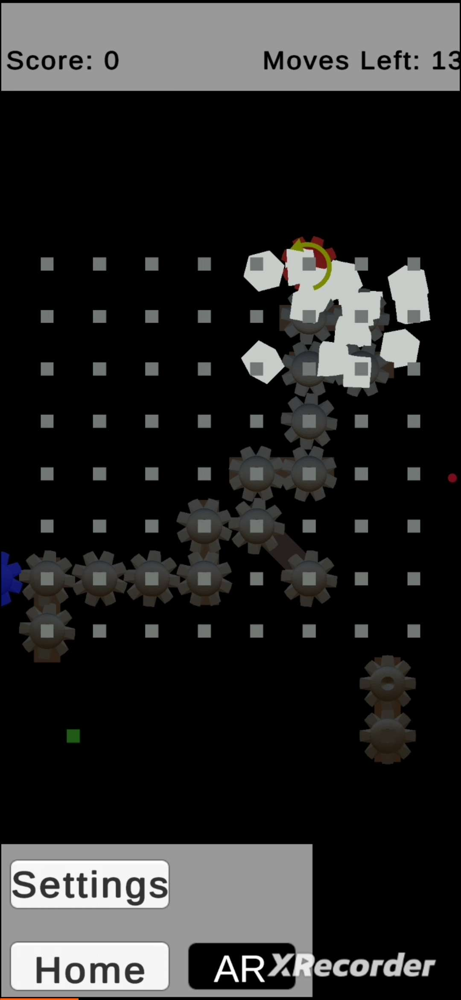
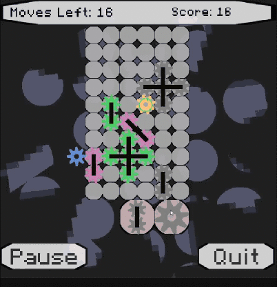
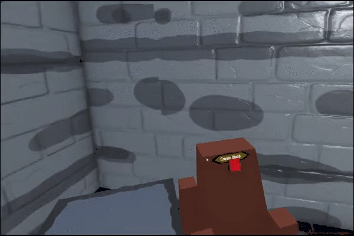
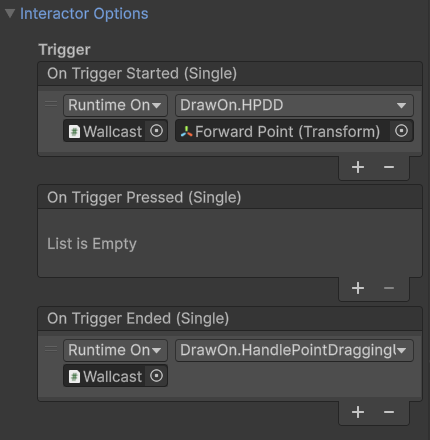

# Anthony Mattera - Game Developer / Technical Designer
I am a Game Developer specializing in Unity, focusing on technical complex projects such as VR/AR. I enjoy creating projects that stand out as unique compared to current market offerings. I’m passionate about collaborating with others and pushing the boundaries of game development into innovative and captivating experiences.
----

If you would like to see jump straight to some of the problems and solutions I've encountered during projects you can check **[here](#problems-solved-during-projects)**. or conversely you can just scroll down 

# Current Showcased Projects
## AR Puzzle Game: GEARS
<table>
<tr>
    <td valign="top" width="60%">
      
       A mobile + AR hybrid game partially inspired by Tetris, where the goal is to rotate gears into a "stuck gear" on the board to break it.

**Role in Development**: Designer and Developer-
Gameplay, UI, AR Foundation, 3D Modeling, Shaders

**Note:** Solo project

**In-Depth Description of role**
Developed from start to finish, this mobile AR hybrid game includes a 
- save/load system 
- custom Shaders 
- Ability to swap between AR/flat mobile mid gameplay

**Tools Used**
Unity, C#, Blender (for gear modeling), Shader Graph, AR Foundation

Play the Game: [Download GEARS APK](https://github.com/MatteraAnthonyJP/Anthony-Mattera-Portfolio/releases/tag/Gears)

    </td>
    <td align="center" valign="top" width="40%">
      
<b>**Demo Video**</b>

      
    </td>
  </tr>
</table>

## Virtual Reality Blacksmithing Tech Demo

<table>
<tr>
    <td valign="top" width="60%">
      
       A VR tech Demo made to showcase designing meshes in real-time. 

**Role in Development**: Designer and Developer-
Gameplay, UI, XR Interaction toolkit, 

**Note:** Solo project.

**In-Depth Description of role**
Developed a VR tech demo
* data powered runtime mesh generation.
* An axis restricted multi-hand grab system
* A custom abstraction layer for physical controller button interactions for held object-dependent controls.
* A custom Shop system for a full gameplay loop
* As well as basic VR interactions including holsters, grabs, dials, levers, and locomotion mechanics.

**Tools Used**
Unity, C#, XR Interaction Toolkit, Shader Graph

**Demo:** For right now demo has to be individually requested

    </td>
    <td align="center" valign="top" width="40%">
      
<b>**Demo Video**</b>

      
    </td>
  </tr>
</table>

## Educational Project - Drawing The Night Sky

<table>
<tr>
    <td valign="top" width="60%">
      
      An educational game created as a capstone project for a museum in Carter Lake, GA. The game helps children learn to identify constellations by connecting stars in the night sky using real star data from the Yale Bright Star Catalogue.

**Role in Development**: Data Validation, Gameplay logic.

**In-Depth Description of role**
- loading star data from a publicly available binary file
- implementing the gameplay functionality for connecting stars
- validating all connections to accurately form constellations. 

**Tools Used**
Unity, C#, json reading

Play the Game: [Download Drawing The Night Sky EXE](https://github.com/MatteraAnthonyJP/Anthony-Mattera-Portfolio/releases/tag/Drawing_The_Night_Sky)

    </td>
    <td align="center" valign="top" width="40%">
      
<b>**Demo Video**</b>

      
    </td>
  </tr>
</table>
 

# Problems Solved During Projects:

## Gears AR/Mobile Game:

### Further context regarding project
This version of the project actually started as a recreation of a college project i made that was rebuilt from the ground up to improve the gameplay, Latency, and Overall Visuals.

### Problem 1) Translation from Flat/AR
Taking a flat puzzle board and dropping it into 3D AR space introduced control issues. Placement was easy—dropping the board onto AR Foundation surfaces and scaling it—but controlling the game on a flat touch screen while moving around physical space felt unresponsive.

### Solution 1)
Dynamic Alignment: Programmed the board to rotate toward the player's camera using Object.RotateTowards with a slight visual offset, keeping interactions natural regardless of player perspective.
Invisible Input Plane: Placed an invisible raycast target directly behind the grid stretching past the screen boundary. This drastically reduced touch miss-rates when placing objects rapidly in 3D space.

 

---

### Problem 2) The Rewrite
In gear mechanics, you inevitably hit physically impossible scenarios—like two adjacent gears trying to rotate into each other in the same direction. Originally, the code only checked direct adjacent neighbors, turning the experience into more of a brick-breaker than a true puzzle game.

### Solution 2)

Breaking conflicting pieces outright filled up the tile board too fast and broke the gameplay loop. Instead, I built a Breadth-First Search (BFS) Algorithm to evaluate gear networks on placement:

- Pattern Tracking: Queued up every individual gear piece in a network while tracking alternating rotational directions to isolate the exact gear breaking physical logic.

- Cascading Chains: Extended the BFS to calculate a returning path all the way back to the main origin gear.

- Mechanic Pivot: Transformed the game's biggest systemic bug into its main feature—triggering satisfying, cascading destruction chains tracing back through the network whenever a wrong move is made.

 

Another Link to the Full video of the demo: https://www.youtube.com/watch?v=sFGd83fBjbc

---

## VR Blacksmithing Game

---
### Problem 1) Mesh Deformation Strategies

I wanted to build a blacksmithing system without running massive calculations that tank VR performance. Standard approaches have major tradeoffs:

1) High-Poly Mesh Deformation: Wastes vertex data, tanks VR performance, and makes physics calculations far too expensive.
2) Purely Visual Bump Mapping: Keeps performance high, but provides zero actual physical geometry for collision or physics simulations.
3) Pre-Determined / "Fake" Deformation: Sacrifices player input and agency by forcing a predetermined visual output.

### Solution 1)

I built a system where a flat surface acts as a dynamic cast for the weapon. The player directly defines midpoints, edge points, height, width, and material parameters to generate the mesh in real time.

Why this works:

1) Full Player Agency: Players get total control over designing the weapon's physical shape.

2) Scalable Performance: Geometry starts at 5 vertices and scales up procedural-style only as needed, keeping physics lightweight and framerates stable.

3) Runtime Flexibility: The lightweight mesh structure allows data to be modified or saved on the fly during gameplay.

---
### Problem 2) VR Controller Buttons

So this problem stems from how The XR toolkit (Unity's VR Solution) Is built. Its most likely easiest to explain after showing a picture of what a VR controller usually looks like button wise 

Unity’s XR Interaction Toolkit doesn't provide an out-of-the-box way to bind non-trigger buttons (like X/Y or A/B) to object-specific actions.

When holding a tool or weapon in VR, you often need controls unique to that specific item—like a safety catch or a secondary action mode. Out of the box, auxiliary buttons remain tied to global inputs rather than the object held in your hand.

 

### Solution 2)

I built a custom, decoupled event system to dynamically route controller inputs based on what object the player is currently holding:

- Hand Event Manager: Created an event manager for each hand tracking active button states and multi-button chord configurations (e.g., holding two buttons at once).

- Custom Interactor: Built an extended interactor component that hooks directly into hand events, allowing held objects to subscribe to secondary button inputs on the fly.

Why this works:

- Contextual Control: Secondary buttons strictly control the held object without global input bleed.

- Multi-Functionality: Single items can run multiple custom functions without hardcoding controls into the player character script.

- Modular Developer Tool: The architecture operates as a plug-and-play module that can be dropped into future VR projects with minimal setup.

Some images showcasing the plug and play nature of it in unity

 

**Another Link to the Full video of the tech demo: https://www.youtube.com/watch?v=7_O5xNfPPn0**

---

## Drawing the Night Sky

This was a two-semester capstone project. My work specifically centered on the constellation mapping system and star data integration, which remained the core backbone of the project.

---
### Problem 1) Showcasing Constellations

The team needed to accurately map visible constellations so players could draw them in real-time. Early prototypes projected flat constellation textures onto a sphere surrounding the player, but the scale was heavily distorted and interactive targeting felt clumsy.

### Solution 1) 

- Data Integration: Integrated the Yale Bright Star Catalogue (a dataset of visible stars) by parsing raw binary files directly from Yale's database.

- Vector Calculation: Extracted coordinates, names, and spatial positions to render a 1:1 visible star map in Unity.

- Data Validation: Cross-referenced catalog entry vectors against selected target constellations to build an precise coordinate-matching gameplay loop.

